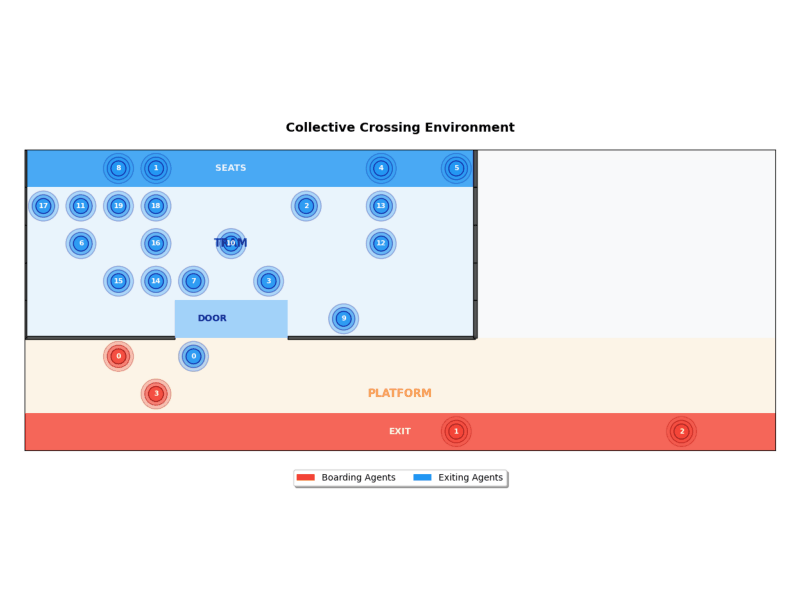

# 🚇 Collective Crossing

<p align="center">
  
</p>

[](https://github.com/nima-siboni/collectivecrossing/actions)
[](https://github.com/nima-siboni/collectivecrossing/actions/workflows/test.yml)
[](https://github.com/nima-siboni/collectivecrossing)

A multi-agent reinforcement learning environment for simulating collective behavior in tram boarding/exiting scenarios. This project provides a grid-world environment where multiple agents interact to achieve their goals while avoiding collisions.

## 🎯 Overview

The `CollectiveCrossingEnv` simulates a realistic tram boarding scenario where:
- **Boarding agents** 🚶‍♂️ start in the platform area and navigate to the tram door
- **Exiting agents** 🚶‍♀️ start inside the tram and navigate to the exit
- **Smart collision avoidance** 🛡️ prevents agents from occupying the same space
- **Configurable geometry** 🏗️ allows customization of tram size, door position, and environment layout

## 🏗️ Project Structure

```
collectivecrossing/
├── 📁 src/collectivecrossing/
│   ├── 🎮 collectivecrossing.py      # Main environment implementation
│   ├── ⚙️ configs.py                 # Configuration classes with validation
│   ├── 🎯 actions.py                 # Action definitions and mappings
│   ├── 🏷️ types.py                   # Type definitions (AgentType, etc.)
│   ├── 📁 utils/
│   │   ├── 📐 geometry.py            # Geometry utilities (TramBoundaries)
│   │   └── 🔧 pydantic.py            # Pydantic configuration utilities
│   ├── 📁 wrappers/
│   │   ├── 🎁 clip_reward.py         # Reward clipping wrapper
│   │   ├── 🎲 discrete_actions.py    # Discrete action space wrapper
│   │   ├── ⚖️ reacher_weighted_reward.py  # Weighted reward wrapper
│   │   └── 📍 relative_position.py   # Relative positioning wrapper
│   └── 📁 tests/                     # Environment-specific tests
├── 📁 tests/                         # Main test suite
├── 📁 examples/                      # Usage examples
├── ⚙️ pyproject.toml                 # Project configuration
├── 🔧 tool-config.toml               # Development tools configuration
└── 📋 uv.lock                        # Dependency lock file
```

## 🚀 Quick Start

### Prerequisites

- **Python 3.10+** 🐍
- **[uv](https://docs.astral.sh/uv/) package manager** ⚡

### Installation

```bash
# Clone the repository
git clone <repository-url>
cd collectivecrossing

# Install dependencies
uv sync

# Install development dependencies
uv sync --dev

# Set up pre-commit hooks
uv run pre-commit install
```

## ⚙️ Configuration System

The project uses a **modern, type-safe configuration system** with automatic validation:

### 🔧 Configuration Building

```python
from collectivecrossing.configs import CollectiveCrossingConfig

# Create a configuration with automatic validation
config = CollectiveCrossingConfig(
    width=12,                    # Environment width
    height=8,                    # Environment height
    division_y=4,                # Y-coordinate of tram/waiting area division
    tram_door_x=6,               # X-coordinate of tram door center
    tram_door_width=2,           # Width of the tram door
    tram_length=10,              # Length of the tram
    num_boarding_agents=5,       # Number of agents trying to board
    num_exiting_agents=3,        # Number of agents trying to exit
    max_steps=100,               # Maximum steps per episode
    exiting_destination_area_y=1,    # Y-coordinate for exit destination
    boarding_destination_area_y=7,   # Y-coordinate for boarding destination
    render_mode="rgb_array"      # Rendering mode
)
```

### ✅ Automatic Validation

The configuration system automatically validates:
- **Tram parameters** 🚇 (door position, width, length)
- **Destination areas** 🎯 (within valid boundaries)
- **Environment bounds** 📐 (grid dimensions)
- **Agent counts** 👥 (reasonable limits)
- **Render modes** 🎨 (valid options)

```python
# Invalid configuration will raise descriptive errors
try:
    config = CollectiveCrossingConfig(
        width=10, tram_length=15  # Error: tram length > width
    )
except ValueError as e:
    print(f"Configuration error: {e}")
```

## 🎮 Using the Environment

### Basic Usage

```python
from collectivecrossing import CollectiveCrossingEnv
from collectivecrossing.configs import CollectiveCrossingConfig

# Create configuration
config = CollectiveCrossingConfig(
    width=12, height=8, division_y=4,
    tram_door_x=6, tram_door_width=2, tram_length=10,
    num_boarding_agents=5, num_exiting_agents=3,
    max_steps=100, render_mode="rgb_array"
)

# Create environment
env = CollectiveCrossingEnv(config=config)

# Reset environment
observations, infos = env.reset(seed=42)

# Take actions for all agents
actions = {
    "boarding_0": 0,  # Move right
    "boarding_1": 1,  # Move up
    "boarding_2": 2,  # Move left
    "boarding_3": 3,  # Move down
    "boarding_4": 4,  # Wait
    "exiting_0": 0,   # Move right
    "exiting_1": 1,   # Move up
    "exiting_2": 2,   # Move left
}

# Step the environment
observations, rewards, terminated, truncated, infos = env.step(actions)

# Render the environment
rgb_array = env.render()
```

### 🎨 Visualization

```python
import matplotlib.pyplot as plt

# Create environment with RGB rendering
config = CollectiveCrossingConfig(
    width=12, height=8, division_y=4,
    tram_door_x=6, tram_door_width=2, tram_length=10,
    num_boarding_agents=5, num_exiting_agents=3,
    render_mode="rgb_array"
)
env = CollectiveCrossingEnv(config=config)

# Reset and render
observations, infos = env.reset(seed=42)
rgb_array = env.render()

# Display
plt.figure(figsize=(12, 8))
plt.imshow(rgb_array)
plt.axis('off')
plt.title('Collective Crossing Environment')
plt.show()
```

## 🧪 Testing

```bash
# Run all tests
uv run pytest

# Run specific test files
uv run pytest tests/collectivecrossing/envs/test_collective_crossing.py

# Run with coverage
uv run pytest --cov=collectivecrossing
```

## 🔧 Development

### Code Quality Tools

This project uses modern development tools:

- **🦀 Ruff** - Fast Python linter and formatter
- **🔒 Pre-commit** - Automated code quality checks
- **📋 Pytest** - Testing framework
- **🔍 Coverage** - Code coverage reporting

### Running Code Quality Tools

```bash
# Pre-commit hooks (run automatically on commit)
git add .
git commit -m "Your commit message"

# Manual linting
uv run ruff check . --config tool-config.toml

# Manual formatting
uv run ruff format . --config tool-config.toml

# Run pre-commit manually
uv run pre-commit run --all-files
```

### Adding Dependencies

```bash
# Add main dependency
uv add package-name

# Add development dependency
uv add --dev package-name
```

## 🎯 Key Features

### 🚇 Environment Features
- **Multi-agent simulation** 👥 with boarding and exiting agents
- **Collision avoidance** 🛡️ prevents agents from overlapping
- **Configurable geometry** 🏗️ customizable tram and door positions
- **Ray RLlib compatible** 🚀 uses MultiAgentEnv API
- **Multiple rendering modes** 🎨 ASCII and RGB visualization

### ⚙️ Configuration Features
- **Type-safe configuration** 🔒 using Pydantic v2
- **Automatic validation** ✅ comprehensive parameter checking
- **Frozen configurations** 🧊 immutable after creation
- **Clear error messages** 💬 descriptive validation failures

### 🏗️ Architecture Features
- **Modular design** 🧩 separated concerns (configs, utils, wrappers)
- **Private encapsulation** 🔐 proper use of private members
- **Clean interfaces** 🎯 public properties for external access
- **Extensible wrappers** 🎁 environment modification system

## 📚 Examples

Check the `examples/` directory for complete usage examples:

```bash
# Run example
uv run python examples/collectivecrossing_example.py
```

## 🤝 Contributing

1. **Fork the repository** 🍴
2. **Create a feature branch** 🌿
3. **Make your changes** ✏️
4. **Run tests** 🧪
5. **Submit a pull request** 📤

## 📄 License

[Add your license information here]

---

**Happy simulating! 🚇✨**
